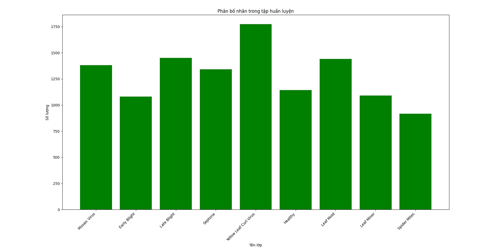
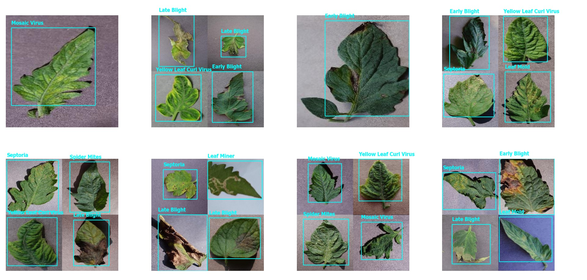
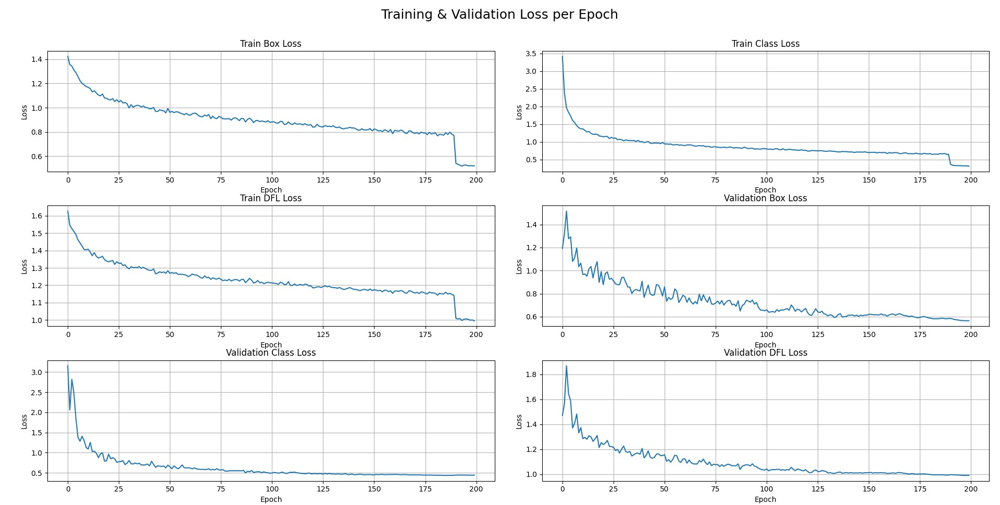
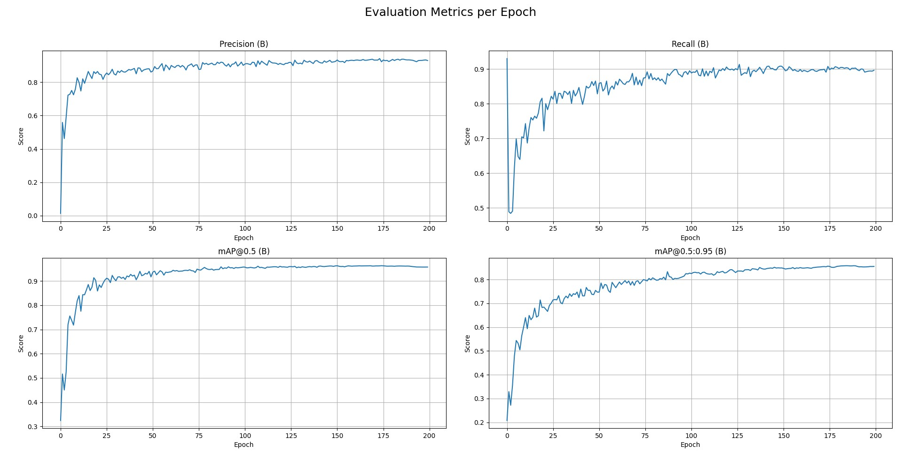
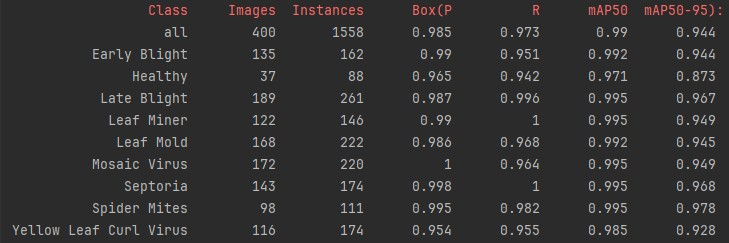
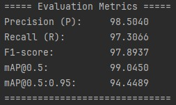
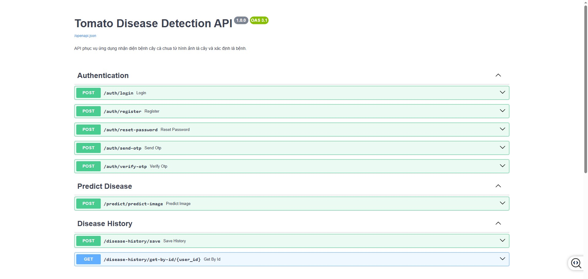
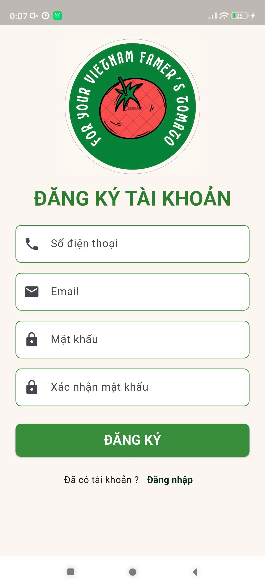
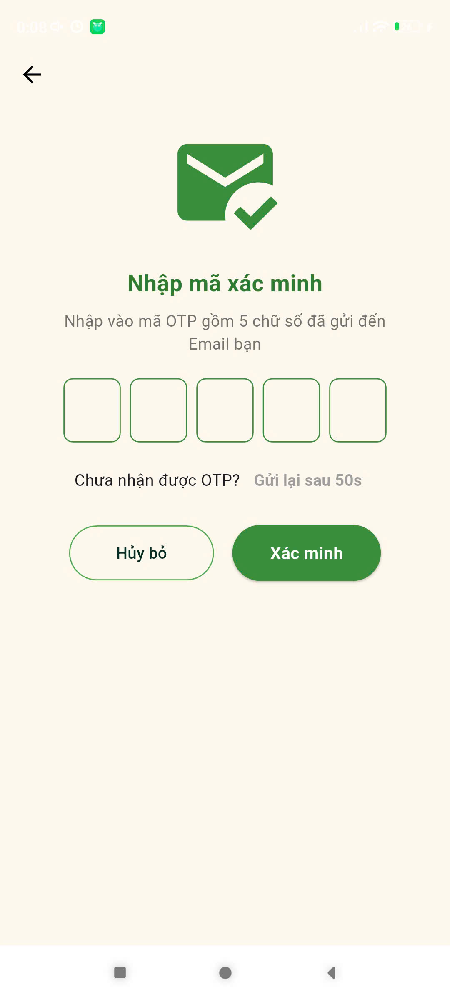
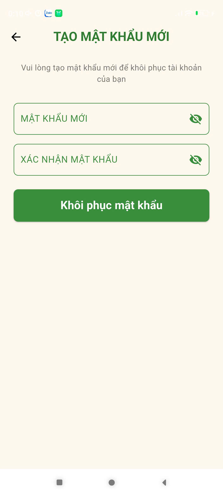

# 🍅 ỨNG DỤNG NHẬN DIỆN BỆNH TRÊN CÂY CÀ CHUA BẰNG HÌNH ẢNH (ỨNG DỤNG MẠNG HỌC SÂU YOLOv12)

Ứng dụng nhận diện bệnh cây cà chua được xây dựng bằng Flutter, kết nối với backend YOLOv12 Nano (FastAPI) để quét ảnh lá cây và dự đoán bệnh.

## 📌 Mô tả

Hệ thống nhận diện bệnh trên cây cà chua gồm **2 thành phần chính**:

- 📱 **Ứng dụng di động Flutter (Frontend):**  
  Giúp người dùng dễ dàng chụp ảnh lá cây, gửi ảnh lên server và hiển thị kết quả dự đoán. Giao diện thân thiện, dễ sử dụng cho cả nông dân và kỹ thuật viên.

- 🧠 **Hệ thống phân tích bệnh (Backend - FastAPI + YOLOv12 Nano):**  
  Nhận ảnh từ người dùng, chạy mô hình học sâu (YOLOv12 Nano) để xác định lá bệnh và phân loại loại bệnh (mốc sương, xoăn lá, đốm vi khuẩn, v.v.).

### ✅ Các tính năng nổi bật:

- **Chụp ảnh hoặc chọn ảnh lá cây từ thư viện.**
- **Tự động khoanh vùng vùng bệnh bằng mô hình YOLOv12.**
- **Dự đoán loại bệnh chính xác bằng AI.**
- **Hiển thị kết quả trực quan và dễ hiểu.**
- **Lưu lịch sử ảnh.**

### 🎯 Mục tiêu dự án:

Hỗ trợ nông dân và kỹ thuật viên nông nghiệp **phát hiện sớm** và **xử lý kịp thời** các loại bệnh thường gặp trên cây cà chua, giúp **giảm thiểu thiệt hại mùa vụ**, tăng hiệu quả sản xuất.

## 🤖 Mô hình mạng học sâu:

---

# 🌱 TỔNG QUAN TẬP DỮ LIỆU

Mô hình mạng học sâu được xây dựng trên 1 tập dữ liệu về **8 bệnh** trên cây **Cà chua** phổ biến tại Việt Nam gồm 4000 ảnh được gán nhãn.

## 📊 Sơ đồ phân bố nhãn

<p align="center">
  
</p>

## 🖼️ Ảnh mẫu

<p align="center">
  
</p>

---

# 🌟 ĐÁNH GIÁ MÔ HÌNH YOLOv12 NANO CHO BÀI TOÁN

Đánh giá mô hình mạng học sâu YOLOv12 sau 200 Epoch huấn luyện.

## 📈 Biểu đồ Loss qua các Epoch huấn luyện

<p align="center">
  
</p>

## 📈 Biểu đồ đánh giá Metrics qua các Epoch huấn luyện

<p align="center">
  
</p>

## 📈 Biểu đồ đánh giá các lớp trên tập Test sau khi huấn luyện

<p align="center">
  
</p>

## 📈 Biểu đồ đánh giá Metrics trên tập test sau khi huấn luyện

<p align="center">
  
</p>

---

### 🧱 Kiến trúc hệ thống:

---

# 🛠️ BACKEND FASTAPI - YOLOv12 Nano (Backend)

Đây là backend API được xây dựng bằng [FastAPI](https://fastapi.tiangolo.com/) cho hệ thống **Nhận diện bệnh cây Cà Chua** bằng mô hình **YOLOv12 Nano**.

## 🚀 Tính năng chính

### 🔐 Authentication
- `POST /auth/login`: Đăng nhập
- `POST /auth/register`: Đăng ký tài khoản
- `POST /auth/reset-password`: Đặt lại mật khẩu
- `POST /auth/send-otp`: Gửi mã OTP
- `POST /auth/verify-otp`: Xác minh mã OTP

### 🔬 Dự đoán bệnh cây cà chua
- `POST /predict/predict-image`: Tải ảnh lên để dự đoán bệnh lá cà chua

### 🧾 Lịch sử dự đoán
- `POST /disease-history/save`: Lưu lại lịch sử dự đoán bệnh
- `GET /disease-history/get-by-id/{user_id}`: Lấy lịch sử dự đoán theo `user_id`

---

## 🧠 Mô hình sử dụng
- **YOLOv12 Nano**: phát hiện lá bị bệnh cây cà chua (bounding box)
- Sau khi cắt vùng chứa lá bệnh, sử dụng CNN để phân loại loại bệnh cụ thể

---

## 🧰 Công nghệ
- `FastAPI` – backend framework
- `YOLOv12 Nano` – phát hiện lá bệnh
- `CNN` – phân loại bệnh
- `Pydantic`, `Uvicorn`, `PostgreSQL`

---

## 📦 Cài đặt Backend

### ⚙️ Yêu cầu:
- Python 3.11+
- pip

### 🧪 Các bước setup:

```bash

# Clone repo
git clone https://github.com/aresu-1704/tomato-disease-detect.git
cd tomato-disease-detect/backend

# Tạo môi trường ảo
python -m venv venv
source venv/bin/activate  # Windows: .\venv\Scripts\activate

# Cài đặt thư viện
pip install -r requirements.txt

# Chạy server
uvicorn main:app --reload
```
---

## 🗃️ Cài đặt Cơ sở Dữ liệu

### ⚙️ Yêu cầu:
- PostgreSQL

### 🧪 Các bước setup:

```bash

#Chạy Script database
psql -U your_postgres_user -d your_database_name -f .DATABASE_SCHEMAS/postgreSQL_database.sql
```

## **⚠️ Lưu ý:**

- Đảm bảo bạn đã cài đặt PostgreSQL và đã tạo một cơ sở dữ liệu trống.

- Thay your_postgres_user bằng tên người dùng PostgreSQL của bạn.

- Thay your_database_name bằng tên cơ sở dữ liệu mà bạn muốn sử dụng.

---

## 📡 Giao diện API (Swagger UI)
<p align="center">
  
</p>

---

# 📱 Flutter App (Frontend)

Ứng dụng nhận diện bệnh cây cà chua được xây dựng bằng Flutter, kết nối với backend YOLOv12 Nano (FastAPI) để quét ảnh lá cây và dự đoán bệnh.

## 📌 Mô tả

Ứng dụng frontend này được xây dựng bằng Flutter để cung cấp giao diện người dùng, cho phép người dùng:
- Đăng nhập, đăng ký và khôi phục mật khẩu.
- Chụp ảnh lá cây và gửi ảnh đến backend để nhận diện bệnh.
- Xem lịch sử các lần phát hiện bệnh.

Ứng dụng này kết nối với backend sử dụng FastAPI và YOLOv12 Nano để xử lý ảnh và trả về kết quả dự đoán bệnh cây cà chua.

## 🚀 Các tính năng chính

- **🔒 Đăng nhập & Đăng ký:** Người dùng có thể đăng nhập vào ứng dụng hoặc tạo tài khoản mới.
- **🔑 Khôi phục mật khẩu:** Tính năng cho phép người dùng khôi phục mật khẩu của mình qua email.
- **📸 Chụp ảnh lá cây:** Người dùng có thể chụp ảnh lá cây cà chua bằng camera.
- **🧠 Nhận diện bệnh cây:** Ảnh sẽ được gửi đến backend và nhận kết quả dự đoán bệnh cây.
- **📜 Xem lịch sử phát hiện bệnh:** Người dùng có thể xem lại lịch sử các lần phát hiện bệnh từ trước.

---

## 🛠 Cài đặt và cấu hình

### Yêu cầu

- Flutter SDK (phiên bản mới nhất)
- Dart SDK
- Trình giả lập Android hoặc thiết bị thực để chạy ứng dụng.

### Cài đặt

1. Clone repository frontend:

   ```bash
   #Clone repo
   git clone https://github.com/aresu-1704/tomato-disease-detect.git
   
   #Chuyển vào thư mục dự án
   cd tomato-disease-detect/frontend
   
   #Cài đặt các phụ thuộc
   flutter pub get
   ```
2. Cấu hình API:

Cấu hình API url trong `lib/constants/api_constant.dart`:

   ```bash
      #Cấu hình URL API backend
      static const String baseUrl = <YOUR_API_URL>;
   ```


### 🖼️ Hình ảnh giao diện ứng dụng

#### 🔐 Xác thực người dùng
<p align="center">
  
  
  
  
  
</p>

---

#### 🌿 Nhận diện bệnh cây
<p align="center">
  
  
</p>

---

#### 📜 Lịch sử & chi tiết dự đoán
<p align="center">
  
</p>

---


